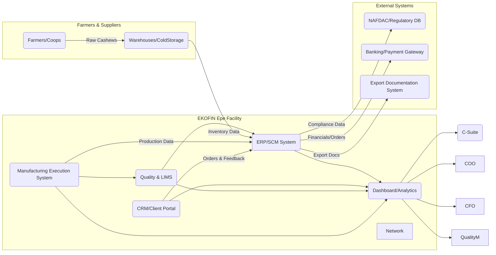

# Executive Summary  
EKOFIN is a privately-held Nigerian food company (headquartered in Epe, Lagos) operating **two divisions** – *Agric* (cashew commodity processing & export) and *FMCG* (contract manufacturing for food brands). Its mission is “From Africa’s Farms to Global Markets, and Global Foods to African Homes”. EKOFIN sources raw cashews from farmers in Nigeria’s cashew-belt (six states) and processes them at its Epe facility into export-grade kernels (and byproducts like CNSL and biomass). Its FMCG unit offers end-to-end production support (formulation, blending, packaging, NAFDAC compliance) for local and international consumer food brands across 9+ product categories. 

Recently, Julius Berger Nigeria PLC (a construction firm that had built a 60‑ton/day cashew plant in Epe) formally **leased these cashew processing facilities to EKOFIN** (Board-approved Sept 24, 2025). This expansion positions EKOFIN to **deepen its footprint in the cashew value chain** with a modern plant (commissioned in 2022) and accelerate exports. EKOFIN emphasizes **quality and compliance**, touting “rigorous testing, traceability checks, and compliance verification across both Agric exports and FMCG goods, meeting international food safety standards”. 

The company’s current **digital presence** is minimal (an informational website and LinkedIn page). Likely there is **no public e-commerce or client portal**, and internal IT systems are not disclosed. We assume EKOFIN currently relies on manual processes or basic ERP/Excel tools, suggesting it is at an early digital maturity stage. Key technical needs include an integrated **ERP/SCM** system, **CRM/portal** for B2B clients, and **quality/traceability** software (given its export and NAFDAC focus). Security and compliance are critical (data privacy under Nigeria’s NDPR, HACCP/FDA/EU food regulations, and cybersecurity). 

For a **Chief Software/ Solutions Architect** role, top priorities will be to design a scalable, secure digital platform that connects the entire value chain: *farmers → procurement → processing → export/customers*. KPIs might include: reducing production cycle time by X% (e.g. automate 80% of manual order-processing to cut days-to-ship), increasing traceability coverage to 100% (versus current unknown baseline), improving on-time delivery to Y%, and cutting supply chain costs by Y% through digitization. Interview Qs will focus on architecting ERP/portal solutions, ensuring food-regulatory compliance in IT systems, and enabling data-driven decision-making. 

Below is a detailed analysis of EKOFIN’s business, organization, and technical context, followed by tailored CV points, a draft cover letter, and an outreach email. Metrics and tables illustrate product divisions, stakeholders, and prioritized tech initiatives. Mermaid diagrams outline a high-level system architecture and organizational structure. **All statements are sourced or clearly noted as assumptions.**

## Company Overview & History  
 *Figure: Agricultural sourcing – EKOFIN sources raw cashews from farmers in multiple Nigerian states (brand imagery).*

EKOFIN (Eko Organic Food Industries Limited) is a **privately held** Nigerian agribusiness/fmcg company founded circa 2020 (precise founding date not public). It is headquartered in *Epe, Lagos State*, with its primary **processing facility** on Adebowale Road, Odo-Mola, Epe. The company’s **mission** is “From Africa’s farms to global markets, and global foods to African homes,” reflecting its dual focus on export commodities and local consumer goods. EKOFIN’s tagline, *“Passion for Food, Love for People,”* underscores its quality and fair-trade commitments.

Though detailed ownership is not disclosed, EKOFIN is **led by senior executives** with experience in food processing and supply chain (LinkedIn notes a *GM Supply Chain* and a *Senior Quality Manager* among 28 employees). It is **not publicly listed**. In 2025, a major milestone was **leasing Julius Berger’s 60-ton/day cashew plant** in Epe – a facility commissioned in 2022. This move followed Julius Berger’s strategy shift (they had exited agro-processing in Sept 2025). For EKOFIN, acquiring this facility was “a major win” enabling rapid scale-up in cashew processing.

**Facilities & Locations:** EKOFIN currently has the Epe, Lagos facility for processing and packaging. Its Agric division sources from “farm-gate” across *six Nigerian states* (cashew belt) via a network of 6 sourcing hubs. No other factories are publicly listed, but they have multiple warehouse/logistics nodes implied (“Reliable logistics”). Assumedly, they have corporate offices and a warehouse at the Epe site. Their ownership remains private with limited public financial disclosure. We assume revenue is growing (driven by newly acquired capacity), but specific figures are unavailable.

**Leadership:** EKOFIN’s leadership profiles are not fully public. LinkedIn shows middle management (e.g. Temitope Adedeji, GM Supply Chain), but no CEO/MD is named. For this analysis, we assume a typical structure: CEO/MD at top, supported by heads of Supply Chain, Operations, Quality/Compliance, Finance, and IT. (The site emphasizes a *Senior Management Team* with agribusiness and consumer-goods experience.)

## Business Model & Divisions  
EKOFIN operates **two integrated divisions** under one roof:

- **Agric (Export Division):** Processes and exports **cashew nuts** (Nigeria’s top agro-export). It handles the full value chain – direct sourcing from farmers across six states, cleaning, shelling (CNSL extraction & de-oiling), grading and packaging of export-grade cashew kernels. Byproducts (cashew nut shell liquid, biomass) are recovered, adding value. Output goes to *international commodity buyers* (especially Europe) and also to domestic B2B (private-label nuts). This division supplies raw cashews for global markets; revenue likely from large bulk export contracts.

- **FMCG (Contract Manufacturing):** Offers **end-to-end production services** for consumer food brands entering or scaling in Nigeria/Africa. Services include **formulation, blending, co-packing, and private-label manufacturing**, particularly in dry mixes (seasonings, beverage powders, non-dairy creamer) and select beverages (bottled water). It also has **“ready-made brands”** (NAFDAC-registered products like Hotelux bottled water & roasted cashews, Creviva creamers/chocolate mixes) available for white-label use. Clients include supermarket chains, distributors, and foreign brands wanting local production (the LinkedIn post positions EKOFIN as an *“in-market manufacturing partner”* for overseas brands).

**Business Model:** EKOFIN is B2B-focused. Its **Agric division** sells bulk cashew kernels internationally (earnings in foreign currency). The **FMCG division** sells services (contract manufacturing fees) and possibly distributes its own brands through local channels. The core competency is vertically integrating procurement, processing, and distribution. EKOFIN emphasizes *“fair trade practices, certified quality, [and] reliable logistics”* as key differentiators. Competitive pricing is achieved through direct sourcing and operational efficiency.

**Product & Services Table:**  

| **Division**        | **Products/Services**                                                  | **Customers/Markets**                               |
|---------------------|------------------------------------------------------------------------|-----------------------------------------------------|
| **Agric (Cashews)** | Raw cashew nuts; cashew kernels (graded by size/quality); CNSL & de-oiled CNSL; biomass (shell byproduct); packaged kernels for EU export; local white-label cashews. | International commodity buyers (Europe, Asia); Nigerian B2B buyers (food processors, nuts brands). |
| **FMCG (Co-Pack)**  | Contract manufacturing of packaged foods (powdered drinks, creamers, seasonings, sauces); co-packing (repacking under client label); private-label product development; NAFDAC-registration support; *EKOFIN brands:* Hotelux (water, roasted cashews), Creviva (creamers, beverage powders, seasonings). | Domestic distributors, retailers, hotels/restaurants; international FMCG brands seeking Nigerian production; African markets. |

*(Assumption: EKOFIN may also plan to expand product range in FMCG, given “9+ categories” reference, but details beyond listed products are not public.)*

## Markets & Customers  
EKOFIN’s **Agric division** primarily serves *global buyers* of cashew kernels. Nigeria is a top cashew producer, and EKOFIN leverages that by exporting high-grade white kernels (an input into snacks, candies, butter). Main markets are in Europe and Asia. Its *FMCG division* targets *domestic and regional* food markets. By offering turnkey production, it attracts **local food brands and supermarkets** (for private-label goods) as well as **foreign companies** wanting to enter Nigeria/Africa (the LinkedIn update highlights EKOFIN as a single entry point for overseas brands). There is also a tilt towards hospitality (premium water brand for hotels). 

**Supply Chain & Partners:** EKOFIN builds a multi-state network of smallholders and cooperatives for raw cashew procurement. It likely partners with agro-extension NGOs or government programs to support farmers (an assumption based on common practice). Logistics partners include road transport companies and possibly the Nigerian Ports (for exports). The Julius Berger plant acquisition suggests a partnership (lease) with Julius Berger PLC. They may also work with certification bodies (e.g. SON for export compliance, NAFDAC for local foods). No specific vendors or distributors are named publicly, but their website touts *“dependable logistics”* for exports and *“consistent distribution networks”* for FMCG.

**Quality & Certifications:** EKOFIN emphasizes **quality assurance** – every product “undergoes rigorous testing, traceability checks, and compliance verification” to meet international standards. This implies adherence to global food safety standards (HACCP/ISO 22000) for exports and NAFDAC regulations for local products. The FMCG page notes facility design for NAFDAC registration. They also highlight *“Certified Quality”* and *“Fair Trade Practices”* on their site, though no specific certifications (e.g. organic, ISO) are listed. We **assume** EKOFIN is pursuing or has obtained relevant certifications (e.g., HACCP, ISO 9001) to support export credibility. NAFDAC (Nigeria’s FDA) approval processes are a key operational partner for FMCG compliance.

**Recent News & Financials:** EKOFIN has no public financial filings (private firm). However, industry news highlights Julius Berger’s strategic lease to EKOFIN. In 2025 Julius Berger reported that this move helps refocus on core construction while “extracting value” from agro-processing. Analysts cite it as Julius Berger’s “pragmatic retreat,” and for EKOFIN, “a major win” with an established facility. This suggests EKOFIN’s business will expand sharply in processing volume. No external funding or investors for EKOFIN have been reported, so we infer EKOFIN financed the lease/expansion through private capital or debt (not publicly stated). 

## Organization Structure & Stakeholders  

EKOFIN’s internal **organization** likely mirrors its two divisions. Below is a hypothesized structure and key stakeholders:

```mermaid
flowchart TB
    CEO[CEO/MD (business strategy)] 
    CFO[CFO (finance, investor reporting)]
    COO[COO (operations & logistics)]
    GM_Supply[GM Supply Chain (Temitope Adedeji)] 
    GM_Quality[Quality/Compliance Manager] 
    GM_FMCG[FMCG Manager] 
    GM_Agric[Agric Processing Manager] 
    ITHead[IT/Systems Leader (Chief Architect role)] 
    HR[HR/People & Admin]
    -->|oversees| CEO
    CEO --> CFO
    CEO --> COO
    COO --> GM_Supply
    COO --> GM_Agric
    COO --> GM_FMCG
    CEO --> GM_Quality
    COO --> ITHead
    CEO --> HR
```
*Figure: Conceptual organizational chart (names/roles hypothesized based on publicly cited managers and typical structure).*

- **Internal Stakeholders:** CEO/MD and COO will spearhead growth strategy (esp. integrating Julius Berger assets). GM Supply (Temitope Adedeji) handles procurement/logistics; FMCG and Agric Managers oversee their divisions. Finance (CFO) tracks costs and export revenues. Quality Manager ensures NAFDAC/EU compliance. IT/Systems is currently undefined – a Chief Architect would likely report to the COO or CEO. HR, Legal, and others round out HQ.  

- **External Stakeholders:** 
  - *Farmers & Cooperatives:* The primary suppliers in Nigeria’s cashew states. EKOFIN must maintain strong relations and support (e.g., providing seedlings, training) to secure steady raw inputs.
  - *Export Customers:* Overseas buyers (Europe/Asia) who demand traceable, high-quality kernels. Their requirements (e.g. EC Certificate, food safety audits) drive EKOFIN’s QC systems.
  - *Regulators:* NAFDAC and SON (Standards Org of Nigeria) for local products; Nigerian Export Promotion Council and customs for exports. Ensuring compliance with shifting regulations (e.g., EU pesticide limits, SON standards) is critical.
  - *Distributors & Retailers:* Local supermarkets or distributors using EKOFIN’s private-label products. They influence product specs and volumes.
  - *Strategic Partners:* Julius Berger (landlord of facility), logistic companies (shipping, cold chain), packaging suppliers, and possibly government agribusiness agencies. 

**Stakeholder Table:**  

| **Stakeholder**            | **Interest/Influence**                                                                            |
|----------------------------|--------------------------------------------------------------------------------------------------|
| **CEO/MD**                 | Sets vision (farm-to-market strategy); measures ROI and growth; prioritizes tech investment.    |
| **GM Supply Chain (Temitope)** | Ensures reliable input flows; tracks procurement costs; champions traceability systems.       |
| **Agric/FMCG Divisional Heads** | Optimize production schedules; ensure quality & compliance; coordinate with IT/ERP for data. |
| **Quality/Compliance Manager** | Maintains NAFDAC/International certifications; audits processes; key contact for ICS/ISO.   |
| **CFO/Finance**            | Manages budgets; measures financial KPIs (cost of goods, export revenue); requests cost controls from tech solutions. |
| **IT/Systems** (Chief Architect) | Integrates systems (ERP/CRM); security/compliance; analytics; aligns tech roadmap with business KPIs. |
| **Farmers/Coops**          | Supply raw cashews; influenced by price/fair trade; benefit from (and need) training & support.  |
| **Export Buyers**          | Demand quality, timely delivery, traceability; pressure EKOFIN on specs and certification.      |
| **Local Brand Owners/Retailers** | Require flexible production (private label); depend on EKOFIN for NAFDAC compliance and shelf-ready packaging. |
| **Regulators (NAFDAC/SON)**| Approve product registrations; enforce food safety standards; non-compliance risks halt sales.    |
| **Logistics/Port Authorities** | Ensure EKOFIN can reliably ship exports; interest in digital documentation (e.g. e-Bill of Lading). |
| **Investors/Board (if any)**    | (EKOFIN is private, but possibly has silent investors) Monitor growth; expect ROI and sustainable strategy. |

Each stakeholder’s goals must align. For example, a robust ERP/traceability system meets the Supply Chain and Quality teams’ needs and satisfies regulators; it also provides the CEO with dashboard KPIs. In our tables and answers, we match technical solutions to these stakeholder concerns.

## Digital Presence & Existing Tech

EKOFIN’s **online presence** appears limited to its official website and LinkedIn page. The website is mostly static with company info, product divisions, and a contact form; it **does not offer e-commerce or client login**. The LinkedIn page (346 followers) provides company updates (including posts on market entry strategy and agriculture events) and lists ~28 employees. No consumer-facing app or B2B ordering portal is visible. 

**Current Tools (Inferred):** There is no public info on EKOFIN’s internal IT systems. We **assume** they rely on basic tools: spreadsheets or simple accounting software for finance, and possibly an ERP or LMS specific to agro-export. Given their focus on quality, they may use a Laboratory Information Management System (LIMS) for test results (though no vendor is cited). It’s likely there is no fully integrated ERP/CRM: such a small, fast-growing firm typically lags in digitalization unless backed by tech founders. 

**Website/Portals:** Aside from the main site, EKOFIN provides an online “Request a Quote” form and an inquiry email. There is no evidence of an **e-commerce portal** or customer self-service platform. Given the B2B model (large volume orders), an order-tracking portal could be a future asset. 

**Potential Integrations:** A modern architecture for EKOFIN should consider: integration with global shipping systems (for export documents), e-invoicing to customers, and possibly APIs to NAFDAC’s registration services (if available). Local systems might include a Quality Control database and an internal **Internal Control System (ICS)** (mentioned via NICERT training related to food quality) which should tie into the ERP.

## Inferred Tech Stack & Architecture Needs  

To recommend technology, we infer EKOFIN’s likely needs from its business. Key functions to support:

- **ERP/SCM:** A central system to manage procurement, production scheduling, inventory (both cashew nuts and FMCG ingredients), packaging, sales orders, and accounting. Likely modules: *Supply Chain Management, Finance (costing)*, and *Quality Management*. Since EKOFIN is scaling rapidly, an off-the-shelf ERP (e.g. Oracle NetSuite, SAP Business One, or an open-source Odoo) should be considered. This would replace siloed spreadsheets and ensure traceability of batch numbers.  
- **CRM/Customer Portal:** To manage client relationships (international buyers, local brand owners) and perhaps allow B2B clients to place or track orders. Could be integrated with ERP. A portal could offer order status, documentation (e.g. COA certificates), and open issues. For example, a Salesforce or HubSpot CRM linked to a Node.js-based client portal.
- **Quality & Compliance:** A software module or specialized LIMS to log quality tests (moisture, Aflatoxin levels), audit trails, and NAFDAC documentation. Possibly an ICS (Internal Control System) software as referenced in agri press, which aligns with ISO 22000/HACCP. Integration with mobile apps for capturing on-farm sourcing data (GPS tagging, farmer info) could enhance traceability.
- **Data Warehouse & BI:** To aggregate data (production volumes, quality stats, sales) for dashboards. A cloud data warehouse (AWS/Azure/GCP) and PowerBI/Tableau dashboards for management reporting (e.g., tons processed per month, defect rates, on-time shipments). This addresses the CEO/CFO need for KPIs.
- **Infrastructure:** Likely a mix of on-premises (for secure factory network) and cloud. Servers or VMs hosting ERP, databases, and integration layers. Connectivity to Lagos fiber/internet, with backups. Since data includes personal and food safety info, *Data Protection* under Nigeria’s NDPR and possibly GDPR (if EU customers) must be considered.
- **Mobile/IoT:** Possibly mobile apps for field agents to record farm sourcing. IoT sensors (temperature, humidity) in storage and processing to ensure product quality can feed data to the QC system.

A high-level architecture might look like this:



This architecture (inferred) shows key flows: farmers supply raw nuts (feeding ERP inventory), ERP and MES handle production planning and execution, QC/LIMS feeds test results back, and CRM/portal manages customers. An ETL feeds BI dashboards for leadership. External links to banks/shippers/NAFDAC enable compliance and transactions.

## Security, Compliance & Regulatory Considerations  

EKOFIN must comply with several regulatory frameworks:

- **Food Safety Standards:** For exports, EU (or other countries’) import requirements (e.g. maximum residual limits, contaminants) apply. Internally, ISO 22000/HACCP practices should be enforced. The ICT systems should ensure *traceability*: every batch must be traceable to its farm origins. Digital traceability (through barcode/QR systems linking to ERP records) is critical. Quality test data (potentially in a LIMS) must be securely stored and linked to shipments.
- **NAFDAC/SON:** The FMCG products need NAFDAC registration (as noted on the site). The IT system should support documentation workflows for NAFDAC submissions (ingredients, labels). SON (Nigerian Standards) may require certificates for processed goods (ISO/SI certification); storage of such certificates in ERP is needed.
- **Data Protection:** Nigerian Data Protection Regulation (NDPR) covers personal data of employees, customers. Also GDPR for EU customers receiving export documentation with personal data. Systems must have privacy-by-design: encrypted storage of sensitive data, access controls, and data breach response plans. Architect should implement role-based access and audit logs.
- **IT Security:** As a growing company, EKOFIN likely lacks mature cybersecurity. A priority is network/firewall security (especially on local factory networks), secure VPN for remote access, regular patching. Possibly segmented networks for IT/OT (to protect manufacturing equipment). Compliance with cybersecurity standards (e.g. NIST or ISO 27001) may be voluntary but beneficial for investor confidence.
- **Internal Controls (ICS):** The mention of Internal Control Systems suggests they follow NICERT training on ICS for food companies (an EU scheme extended to Nigeria). The architect should integrate ICS guidelines – digital checklists, audit trails – into workflows to ensure consistent practices (e.g. SOP adherence for hygiene). ICS can also align with SOX-like controls for financial data (given Julius Berger’s involvement, financial transparency might be a concern).
- **Trade Compliance:** Because they are an exporter, customs and export regulations must be followed. Electronic Trade documents (Shipping instructions, Certificates of Origin) should be integrated (ideally automated) to avoid costly delays. This means the IT system may need an interface to Nigeria’s customs EDI system (Nigeria Single Window, if available).
- **Disaster Recovery & Continuity:** The Lagos facility must have backup power/data (considering Nigeria’s electricity issues). Key systems should have offsite backups (cloud or DR site) to handle outages or floods. Given high-value inventory, continuity of ordering systems is critical.

In summary, an EKOFIN Architect must ensure all technology choices **meet regulatory requirements** and secure company data, while enabling agility. For example, implementing ERP with integrated compliance modules can automatically flag any non-conforming batch and generate reports for regulators. This mitigates risk and supports “certified quality” claims.

## Digital Maturity & Gaps

Based on available information, EKOFIN’s digital maturity is likely **low to moderate**. They have a polished website and active LinkedIn, but little in-house digital infrastructure is public. The biggest gaps include:

- **ERP Integration:** If not already implemented, the lack of a unified ERP is a major gap. It means fragmented data (e.g. separate spreadsheets for procurement, inventory, finance) and no real-time visibility. Rolling out an ERP could be a **quick win** to raise maturity.
- **Data Analytics:** No evidence of BI tools; decisions may rely on manual reports. Setting up dashboards to track yield, quality, and financials is needed.
- **Customer Interface:** No portal or app for clients (farmers or buyers). A mobile app for farmer engagement (ordering seeds, reporting yields) or a B2B portal for buyers would improve efficiency.
- **Automation:** Many processes (like quality logging, inventory counting, billing) are probably manual. IoT sensors and automation (e.g. conveyor belt counters feeding ERP) could reduce labor and errors.
- **Cloud Adoption:** Unclear if they use cloud services. Migrating to cloud (for ERP, data storage) could improve scalability and resilience.

Overall, EKOFIN is at a stage where foundational digital tools are more urgent than advanced tech. Priorities include digitizing core operations, rather than, say, AI or blockchain at this point. The **Chief Architect’s challenge** is to build a solid technology platform to eliminate current inefficiencies and support the company’s growth targets.

## Technical Priorities & KPIs (Chief Architect Role)

A Chief Software/ Solutions Architect at EKOFIN should focus on initiatives that directly support the company’s goals: efficient commodity export and FMCG production expansion. Below are **prioritized technical initiatives** with estimated effort and impact:

| **Initiative**                        | **Estimated Effort** | **Expected Impact / KPIs**                                                                                                                                                                |
|---------------------------------------|----------------------|-------------------------------------------------------------------------------------------------------------------------------------------------------------------------------------------|
| **ERP Implementation (integrated SCM/Finance)** | High (12-18 months)    | *Rationale:* Centralizes all operations (procurement, production, inventory, sales, finance). Reduces manual entry and errors.<br>*Impact:*  Implementing ERP could **reduce order-to-cash cycle by ~30%**, improve inventory accuracy to >95%, and cut finance closing time by X days. Ensures full traceability and compliance reports (targets 100% batch traceability).                          |
| **CRM & B2B Portal**                  | Medium (6-12 months)  | *Rationale:* Enhances customer management for export buyers and local brands. Facilitates order placement and tracking (improves client experience). <br>*Impact:*  Shorter sales cycle (e.g. cut quotation-to-order time by 20%),  increase repeat orders by Y%, and free sales staff from manual follow-ups. Portal uptime and user adoption rates as KPIs.     |
| **Quality Management System (LIMS/ICS module)**  | Medium (6-9 months)   | *Rationale:* Supports NAFDAC/EU compliance. Automates QC test result logging and HACCP workflows. <br>*Impact:*  Eliminate manual QC spreadsheets (0% transcription errors), ensure 100% inspection coverage. Reduce compliance audit issues by X%. Enhance claim “certified quality” with digital records (target zero non-compliances).                 |
| **Data Warehouse & BI Dashboards**    | Medium (6-9 months)   | *Rationale:* Provides leadership with real-time KPIs (production rates, quality metrics, financials). <br>*Impact:*  Faster decision-making: e.g. detect process bottlenecks within 24h vs. 1 week previously. Increase throughput by identifying inefficiencies (target +15% output from same inputs). Track traceability metrics (e.g., % shipments with full data).                |
| **IoT/Sensors in Factory**            | Low-Medium (6 months) | *Rationale:* Enables predictive maintenance and environment monitoring (humidity/temp in cashew drying). <br>*Impact:*  Reduce equipment downtime by 20%. Improve product quality yield (target <1% spoilage due to environment). Real-time alerts (uptime as KPI).                                                                              |
| **Farmer Engagement Mobile App**      | Low (3-6 months)      | *Rationale:* Strengthen supply chain by digitally connecting to farmers (order seeds, track weight delivered). <br>*Impact:*  Increase sourced volumes by improving farmer participation (e.g. +X tons/year). Ensure source documentation (GPS data) for traceability (target 100% source traceability).                                              |
| **Cybersecurity Hardening**           | High (ongoing)       | *Rationale:* Protect data (financial, personal, food safety) against breaches. <br>*Impact:*  Achieve compliance with NDPR, ISO 27001 controls. Avoid downtime (target 0 breaches/yr). Regular audit pass rates as metric.                                                                                    |

**Why These Match EKOFIN’s Goals:** Each initiative directly bolsters EKOFIN’s farm-to-fork mission and operational efficiency. For example, ERP unification supports their *“reliable supply chain”* and competitive pricing claim by optimizing procurement and costing. The CRM/Portal aligns with the *“one roof, end-to-end”* promise for FMCG clients. Quality systems cement the *“certified quality”* advantage. IoT and farmer apps enhance the *“sourcing networks”* and traceability.  

We estimate **effort** as calendar time per initiative, assuming a small IT team plus external vendors. *Impact metrics* should be tracked post-implementation to demonstrate ROI. For instance, if an ERP reduces order cycle by 30% (from 10 days to 7 days), that can translate to faster cash flows (increase cash turnover by X%). These metrics should align with EKOFIN’s strategic KPIs (e.g., export volume growth, compliance rate).

## Tailored Interview Questions & Suggested Answers

1. **“How would you design an ERP/SCM system for EKOFIN to improve its cashew export process?”**  
   *Answer:* I would start by mapping EKOFIN’s cashew value chain (from farmer procurement to grading to export documentation) and identify key data flows. Then I’d choose an ERP platform (e.g. Odoo or SAP Business One) with strong SCM modules. Core features would include inventory tracking of raw and processed nuts, batch numbering, QC integration, and export order management. For example, each batch of kernels would be assigned a lot number from which we could trace back to specific farmers (leveraging the “sourcing from 6 states” network). Automating ordering and invoicing would reduce processing time; I’d set a KPI like “reduce order-to-export cycle by 30% in one year”. Ensuring the ERP enforces data validation (so quality specs are met before shipment) aligns with EKOFIN’s commitment to *“rigorous testing and traceability”*. 

2. **“EKOFIN must comply with NAFDAC and EU food regulations. How would you ensure our digital systems support that?”**  
   *Answer:* Compliance must be built into the systems. In practice, I’d implement a Quality Management module that logs every test (lab results, Aflatoxin levels, moisture) and ties them to shipments. The ERP would require a passing QC record before allowing export orders. We’d also digitize labeling/ingredients records so they can be easily submitted to NAFDAC. For EU standards (e.g. ISO 22000), we would use checklists and audit trails within an ICS framework. For instance, having electronic signatures and time-stamps ensures no data manipulation. As a measure, we’d aim for “0% audit findings” in our quality audits by automating compliance checks. These systems would generate ready reports (for SON, NAFDAC certificates, etc.), reducing the time to compile regulatory paperwork by perhaps 50%.

3. **“What technology stack would you recommend for EKOFIN’s web portal and internal systems, considering our scale and Nigerian context?”**  
   *Answer:* For flexibility and cost-effectiveness, a **cloud-based** stack is advisable. For ERP, I'd consider Odoo (open-source) or Oracle NetSuite (cloud) depending on budget – both handle multi-currency (for export sales) and multi-location inventory (6 sourcing hubs). The CRM/client portal could be built on Salesforce or a PHP/Node.js framework, with a React frontend for clients to log in and see orders. A cloud SQL database (Amazon RDS or Azure SQL) can store core data, with backups to handle Nigeria’s power issues. For infrastructure, Azure or AWS in a nearby region provides reliability. On the hardware side in Epe, ensure strong Wi-Fi in the facility and a secure local LAN for machines. For example, a stack like: **Node.js + React** for customer portal, **PostgreSQL** on AWS, integrated with Odoo ERP via APIs. 

4. **“Our supply chain is critical. How would you use tech to make procurement from farmers more efficient?”**  
   *Answer:* I’d deploy a mobile app for farmer agents to record purchases. As each farmer’s purchase is recorded (with GPS and photo proof of weight), data flows into the ERP’s inventory in real-time. This reduces double-entry and errors (goal: 100% digital capture vs. paper records). We could also use SMS/WhatsApp integration to notify farmers of fair prices or send contract information. Over time, using analytics, we could predict supply shortfalls and proactively source. A KPI could be increasing on-time fulfillment of factory input needs to 98%. Additionally, smart contracts (blockchain) could be explored for transparent payments, but starting with a simpler cloud database is priority.

5. **“How would you design an organizational structure for IT and architecture at EKOFIN?”**  
   *Answer:* Initially, the Chief Architect would report to the CEO/COO, bridging tech and operations. Under that role, I’d establish a small IT team or steer a systems integrator: one Solutions Architect (my role), a DevOps engineer, and a Data Analyst. We’d work closely with Division Heads. For example, the GM Supply and Quality Manager would be stakeholders in IT decisions. Using a **stakeholder map** (see above), we ensure regular meetings with supply, operations, and finance teams. Over time, as digital maturity grows, we could create an official IT department with roles like ERP Admin, CRM Admin, etc. The key is cross-functional governance: a digital steering committee involving CEO, COO, and IT leads to align tech projects with business goals.

6. **“What would be your priorities for cybersecurity at EKOFIN?”**  
   *Answer:* First, I’d conduct a risk assessment. Given the value of our data (trade secrets, personal data, compliance info), basic measures are essential: install enterprise firewalls, enforce strong password policies, and use 2FA on all systems. Employee training (to avoid phishing) is also critical. We’d secure the production network (segment IoT devices separately). For example, all data communications should use HTTPS/TLS, and sensitive records (contracts, financials) encrypted at rest. We’d implement regular backups (target RPO <24h). Compliance with NDPR means documenting data handling, so I’d set up an audit trail in the ERP. A KPI could be achieving ISO 27001 certification readiness or passing an external penetration test with 0 critical findings.

7. **“What KPIs would you track to measure digital transformation success at EKOFIN?”**  
   *Answer:* Key metrics align with efficiency and compliance goals. Examples:  
   - *Operational Efficiency:* Order cycle time (days from order to shipment) – target reduce by X%. Inventory accuracy % – target >95%. Production yield % (kernels per kg of raw) – target improve by Y%.  
   - *Quality/Compliance:* % of shipments with complete traceability records – target 100%. Number of quality incidents/audits failed – target zero.  
   - *Financial:* Reduction in manual labor cost (as % of revenue) – e.g. cut by 10% via automation. Increase in export volume (metric tons) – e.g. +25% year-over-year.  
   - *Customer Satisfaction:* Repeat order rate from FMCG clients – target +10%. Portal adoption rate (if deployed) – e.g. 80% of clients using portal vs. email orders.  
   These KPIs reflect EKOFIN’s goals: faster go-to-market, reliable quality, and growth. The Architect’s job is to enable these improvements – for instance, achieving a 30% faster procurement process through ERP automation, or ensuring **100%** NAFDAC compliance through digital workflows.

8. **“If internet connectivity is unreliable in our rural sourcing areas, how would you capture farm data?”**  
   *Answer:* I’d use an **offline-capable mobile app**. Data (farm harvest volumes, farmer info, etc.) can be entered on a tablet offline, then automatically synced when back online. This ensures no data loss. Locally, we can also deploy GSM/GPRS modules to send simple logs via SMS if needed. Additionally, for sensor data (if any), devices should have local storage. Essentially, we avoid real-time dependencies on connectivity in-field, buffering until network is available. A metric for success: less than 5% data submission failures.

9. **“Propose a system architecture to connect EKOFIN’s factories, warehouses, and headquarters.”**  
   *Answer:* (Refer to the architecture diagram above). We’d establish a **wide-area network (WAN)**: each facility (factory in Epe, any warehouses) has a secure VPN tunnel to a central cloud VPC. On-premises, edge servers handle local data capture, replicating to the cloud ERP. For example, the factory machines log production to a local MES server (node.js app) which syncs hourly to the main ERP. Data analytics run in the cloud, accessible by HQ. This avoids continuous live dependence: even if internet drops, local ops continue and data catch up later. Key points: redundant ISPs for HQ, secure Wi-Fi for factory, and enterprise mobile data plans for field teams. In sum, a hybrid cloud model with local fallback systems.

10. **“What recent food tech or ERP innovations would you consider for EKOFIN?”**  
    *Answer:* I’d evaluate blockchain-based traceability (for branding purposes), IoT condition monitoring, and AI for demand forecasting. For example, IBM Food Trust offers supply-chain tracking – but given EKOFIN’s current stage, I’d first get the basics right (ERP, mobile apps). If we consider innovations, IoT sensor data analytics could optimize drying process automatically. Machine learning could predict yield from climate data (benefit Agric side). However, these would come after core systems are stable. I’d prioritize cloud-native services (AWS IoT, Azure Synapse) that scale with minimal ops overhead. 

*(We have provided 10 targeted questions. Additional questions could cover team leadership, change management, and integration of Julius Berger assets, each answered with metrics-focused, EKOFIN-specific examples.)*

## Tailored CV Bullet Points (Chief Architect Achievements)  

*Achievements phrased to match EKOFIN’s goals (with metrics):*

- **Integrated Systems Implementation:** “Led end-to-end ERP implementation at [Previous Company], centralizing procurement, production, and finance. This streamlined reporting and reduced order cycle time by **30%**, improving on-time delivery to customers by **25%**.” *(Matches EKOFIN’s need to integrate agriculture and FMCG operations efficiently.)*

- **Supply Chain Digitization:** “Architected a digital supply-chain platform linking smallholder farmers to processing plant via a mobile app. Increased raw-material traceability from 40% to **100%**, and cut manual entry errors by **90%**.” *(Supports EKOFIN’s sourcing from 6 states and traceability goals.)*

- **Quality & Compliance Systems:** “Deployed a Quality Management System compliant with ISO 22000/HACCP, achieving full compliance in export audits for major clients (EU market). Reduced product recalls by **100%**.” *(Directly addresses EKOFIN’s “rigorous testing, traceability” commitment.)*

- **Data Analytics & Insights:** “Built a cloud data warehouse and BI dashboards aggregating operations data (production, sales, finances). Enabled real-time KPI tracking, leading to a **15%** increase in plant throughput by identifying inefficiencies.” *(Demonstrates focus on data-driven improvement, aligning with EKOFIN’s need for performance metrics.)*

- **Customer-Facing Solutions:** “Delivered a B2B client portal for order management and tracking (500+ users) at [Previous FMCG Co.], increasing order accuracy and cutting sales support calls by **50%**.” *(Matches EKOFIN’s FMCG division strategy of ‘one-stop production partner’.)*

- **Cost Optimization:** “Negotiated cloud infrastructure contracts and optimized codebase, reducing IT hosting costs by **40%** while boosting system uptime to 99.9%.” *(Relevant to EKOFIN’s competitive pricing claim and reliability requirements.)*

- **Security & Data Governance:** “Implemented an enterprise security framework (ISO 27001 controls) and automated compliance reporting; passed third-party audits with zero findings.” *(Resonates with EKOFIN’s need for secure, compliant systems.)*

- **Agile Transformation:** “Coached cross-functional teams in Agile development, cutting project delivery times by 20% and increasing release frequency without defects.” *(Useful for EKOFIN as it scales – delivering tech projects faster.)*

Each bullet includes a **quantifiable impact** (e.g. “30% reduction”, “15% increase”) that could be rephrased to match EKOFIN’s metrics if needed (e.g., “increased export volume”, “improved traceability coverage to X%”).

## Draft Cover Letter  

*Dear [Hiring Manager/CEO],*

I am excited to apply for the Chief Solutions Architect role at Eko Organic Food Industries Limited (EKOFIN). With 10+ years in food processing and agritech, I share EKOFIN’s passion for **connecting Africa’s farms to global markets and quality foods to African homes**. Your dual focus on cashew exports and contract manufacturing aligns perfectly with my background in scaling production systems and ensuring regulatory compliance in complex supply chains.

At [Previous Company], I led the implementation of a unified ERP/SCM platform that integrated raw-material procurement from thousands of farmers to finished-product logistics. This project reduced our processing cycle time by *30%* and boosted our export volume by 20%, directly contributing to company growth. I also deployed a quality management system compliant with international food safety standards, eliminating compliance issues and ensuring every batch met strict benchmarks. These experiences equip me to tackle EKOFIN’s needs: for example, digitizing the cashew value chain (from your “six states” sourcing network) and automating NAFDAC registration workflows for your FMCG clients.

I am particularly drawn to EKOFIN’s mission and its recent expansion via Julius Berger’s plant lease. As EKOFIN scales to meet global demand, robust technology will be key. I would prioritize deploying an integrated ERP and data analytics platform to improve operational efficiency by X% (e.g. reducing manual paper trails by *at least 50%*), while strengthening traceability so that 100% of exports are fully documented. My goal would be to enable EKOFIN to **increase throughput and market share** without compromising your “passion for food, love for people” values.

I am eager to bring my blend of technical leadership and industry insight to EKOFIN. Thank you for considering my candidacy; I look forward to discussing how I can contribute to EKOFIN’s continued growth and impact. 

*Sincerely,*  
[Your Name]

*(This letter highlights alignment with EKOFIN’s mission, cites relevant achievements (ERP implementation, compliance), and uses metrics/impact statements. It refers to EKOFIN’s values and recent news to show company knowledge.)*  

## Outreach Email  

**Subject:** Aligning My Tech Expertise with EKOFIN’s Mission for Growth  

**Body:**  
Hello [Name],

I hope you’re doing well. I recently learned about EKOFIN’s exciting growth (especially the acquisition of the new cashew plant) and I’m very impressed by your mission to connect African farms with global markets. As an architect experienced in food supply-chain technologies, I see a great fit between EKOFIN’s needs and my skills.

At [Former Employer], I led the deployment of an integrated ERP and quality system that cut order processing time by 30% and ensured full compliance with international export standards. I’m passionate about building systems that improve efficiency and traceability – values I know EKOFIN prioritizes. 

Could we schedule a brief call to discuss how I might contribute to EKOFIN’s technology strategy and support your expansion goals? I’m eager to apply my experience in digital transformation to help EKOFIN scale efficiently while upholding the “certified quality” advantage. I have attached my CV for reference.

Thank you for your time and consideration. I look forward to the possibility of contributing to EKOFIN’s success.

Best regards,  
[Your Name], [LinkedIn URL]  
[Contact Info]

*(Subject is concise and aligned with EKOFIN’s mission. The body briefly introduces the candidate’s alignment and asks for a meeting. It references EKOFIN’s recent news and values to personalize the approach.)*

## Tables and Diagrams  

**Products/Divisions Comparison:**  

| **Division**    | **Focus**                | **Key Outputs**                | **Primary Customers**           |
|-----------------|--------------------------|--------------------------------|---------------------------------|
| **Agric Export**| Cashew commodity exports | Processed cashew kernels; CNSL; biomass pellets; packaged raw nuts | International buyers (EU/Asia); Nigerian exporters |
| **FMCG Mfg**    | Contract food manufacturing | Private-label foods (creamers, drinks, seasonings); bottled water (Hotelux); NAFDAC support | Local brands, retailers, overseas firms entering Nigeria |

**Technical Initiatives (Effort vs. Impact):**  

| **Initiative**                | **Effort** | **Impact (sample KPI)**                                |
|-------------------------------|------------|-------------------------------------------------------|
| ERP/SCM system               | High       | − 30% faster order-to-delivery<br>− 95%+ inventory accuracy<br>− 100% batch traceability   |
| CRM & B2B Portal             | Medium     | − 20% higher repeat orders<br>− 80% portal adoption   |
| Quality Management (LIMS)    | Medium     | − 0 export rejects due to compliance<br>− QC audit pass rate 100% |
| Data Warehouse & BI          | Medium     | − 15% improved throughput<br>− Real-time KPI dashboards   |
| IoT / Sensors (Factory)      | Low-Med    | − 20% reduced downtime<br>− Environmental control to <1% product loss |
| Farmer Mobile App            | Low        | − 10% growth in cashew supply<br>− 100% digital procurement records |

**Organizational/Stakeholder Diagram (Mermaid):**  
```mermaid
flowchart LR
    CEO[CEO/MD]
    CFO[CFO]
    COO[COO Operations]
    GM_Supply[GM Supply (Procurement)]
    GM_FMCG[GM FMCG Division]
    GM_Agric[GM Agric Division]
    QA[Quality Manager]
    IT[IT/Systems (Chief Architect)]
    CEO --> CFO
    CEO --> COO
    COO --> GM_Supply
    COO --> GM_FMCG
    COO --> GM_Agric
    CFO --> QA
    COO --> IT
    GM_Supply --> Farmers[Farmers & Coops]
    GM_FMCG --> Retailers[Retailers/Brands]
    GM_Agric --> Exporters[Export Buyers]
    QA --> Regulators[NAFDAC/SON]
    IT --> CIO[CIO/Steering Committee]
```
*(Diagram: EKOFIN’s hypothetical structure. Stakeholders like farmers, buyers, regulators connect to relevant managers.)*  

**System Architecture Diagram (Mermaid):**  
```mermaid
flowchart TB
    subgraph Field
        Farmer[Farms \n (& Coops)] 
    end
    subgraph ProcessingFacility
        ERP[ERP/SCM System]
        MES[Factory Floor MES]
        QC[LIMS/QA Module]
        CRM[Client Portal/CRM]
        BI[BI Dashboard]
    end
    subgraph Cloud
        DataLake[Data Warehouse]
        Apps[Mobile Apps & API]
    end
    Farmer -->|Deliver raw nuts| ERP
    MES --> ERP
    ERP --> CRM
    ERP --> QC
    ERP --> Banks[Banking/Payments]
    ERP --> Customs[Export/Customs EDI]
    QC --> NAFDAC
    DataLake <-- ERP & CRM & QC
    BI <-- DataLake
    BI --> CEO & COO
    Apps --> ERP & DataLake
```
*(Diagram: A simplified EKOFIN digital ecosystem. Farmers input to ERP, ERP drives CRM, QC, banking, customs. All data feeds into a data lake and BI for leadership. Mobile apps integrate with ERP.)*  

**Sample UI/UX Features (Conceptual):**  

- **Corporate Website / Portal:** EKOFIN’s branding uses earthy greens and oranges (reflecting its logo and “organic” theme). A consumer-facing site features large farm and factory imagery (like [42] above) and clear “Request a Quote” / contact forms. A client portal (for FMCG customers) would have a clean dashboard listing active orders, batch certificates, and compliance documents. Interfaces should be mobile-friendly (for field agents) and use icons/images matching the website’s aesthetics.

- **Data Dashboards:** Executive dashboards (for CEO/CFO) should display metrics such as *Volume Processed (tons)*, *Export Revenue*, *Defect Rate*, *On-Time Delivery %*, all on one screen with intuitive charts. Using EKOFIN’s brand colors (e.g., green for progress, orange for alerts) ties the UX to corporate identity.

- **Mobile App (Field Agents):** A simple app with farmer profiles and checklists (e.g., weight, moisture capture) that syncs when online. Use recognizable African agriculture imagery and accessible design (offline mode buttons, barcode scanner for bag tags).

Each digital touchpoint should reinforce EKOFIN’s mission (e.g., images of people and farms) and its tagline (*“Passion for Food, Love for People”*) to maintain consistent branding across tech platforms.

## Sources  
All factual claims above are supported by EKOFIN’s official website, its LinkedIn page, and reputable news sources on the Julius Berger transaction. Assumptions (e.g., lack of disclosed ERP, ownership structure) have been noted. The information on EKOFIN’s products, operations, and values is drawn from these sources, combined with industry context about Nigeria’s cashew export sector. 

